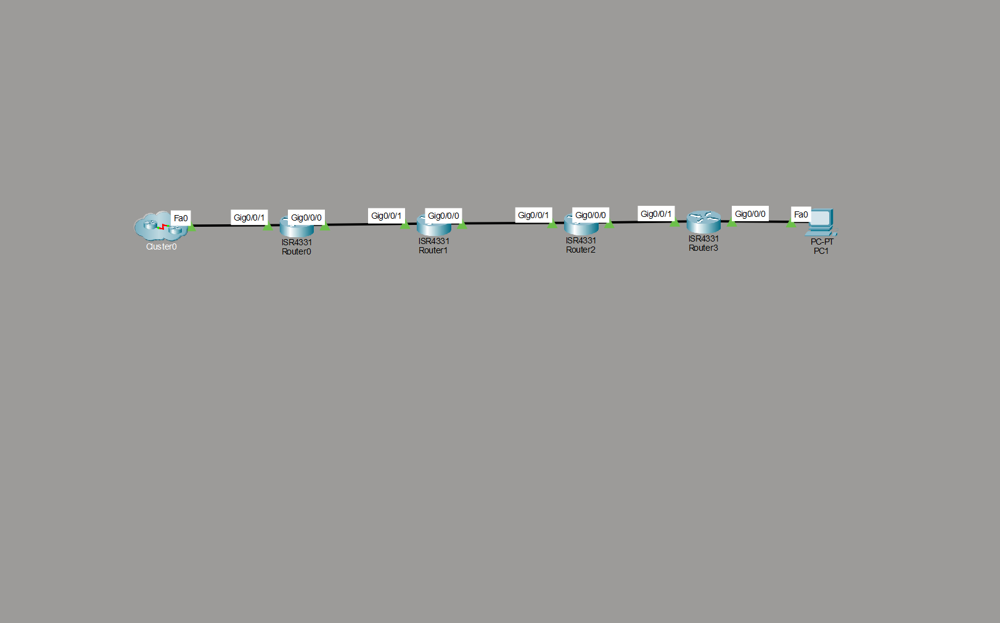

# GRE Tunnel Network Lab

---

## 📌 Overview
This project demonstrates the implementation of a GRE (Generic Routing Encapsulation) tunnel between two edge routers (R0 and R3) over an underlying routed network.

The goal is to enable communication between two separate LANs while enforcing a strict requirement: allowing only GRE traffic between R0 and R1.

---

## 🧠 Technologies Used
- GRE Tunnel (Overlay)
- OSPF (running inside the tunnel)
- Static Routing (Underlay)
- ACL (Access Control List for traffic restriction)

---

## 🏗️ Topology

---

## 📂 Project Structure
configs/
R0.txt
R1.txt
R2.txt
R3.txt

All router configurations are organized for clarity and easy reproduction of the lab.

---

## ⚙️ How It Works

### 🔹 Underlay Network
The physical network (R0 → R1 → R2 → R3) uses static routing to provide reachability between tunnel endpoints.

### 🔹 GRE Tunnel (Overlay)
A GRE tunnel is established between R0 and R3, creating a virtual point-to-point link over the underlay network.

Traffic is encapsulated inside GRE packets and transported across intermediate routers.

### 🔹 OSPF over the Tunnel
OSPF runs only inside the GRE tunnel:
- R0 advertises `192.168.1.0/24`
- R3 advertises `192.168.2.0/24`

This allows dynamic routing without exposing routing protocols to the underlay.

### 🔹 Traffic Restriction (ACL)
An ACL is applied on the R0–R1 link:
- ✅ Allows GRE traffic only  
- ❌ Blocks all other IP traffic  

---

## ✅ Verification

### 1. Check Tunnel Status
show ip interface brief

Expected:
Tunnel0 up up

---

### 2. Verify OSPF Neighbor
show ip ospf neighbor

---

### 3. Check Routing Table
show ip route

Expected:
- R0 learns `192.168.2.0/24`
- R3 learns `192.168.1.0/24`

---

### 4. Test Connectivity
From PC0:
ping 192.168.2.10

---

### 5. Verify ACL Operation
show access-lists

Expected:
- GRE traffic counters increasing

---

## 💡 Improvements

- Add **IPsec over GRE** for encryption  
- Use **Loopback interfaces** as tunnel sources for better stability  
- Implement **redundancy** (backup tunnel or alternate path)  
- Introduce **dynamic routing in the underlay** with adjusted ACL rules  

---

## 🧠 Key Concepts Demonstrated

- Separation between **Underlay (physical network)** and **Overlay (logical tunnel)**  
- GRE encapsulation for transporting traffic across intermediate networks  
- Running dynamic routing protocols securely inside a tunnel  
- Enforcing traffic policies using ACLs  

---

## 🎯 Summary

This lab demonstrates how to:
- Build a GRE tunnel across multiple routers  
- Restrict traffic to GRE only using ACLs  
- Run OSPF inside the tunnel to enable LAN-to-LAN communication  

It reflects real-world networking design principles used in modern architectures such as SD-WAN.
